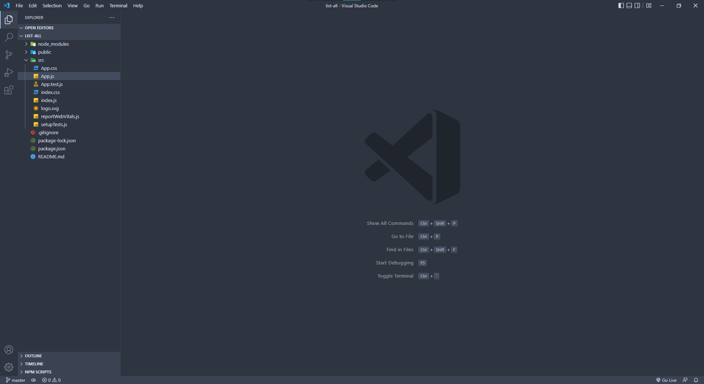
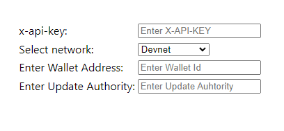

## How to fetch all NFTs from your wallet using SHYFT APIs?

Now this sample React project will illustrate how to fetch all NFTs form a a particular wallet. We accept your public key and list all the NFTs from your wallet.

Let's create a simple form to accept all the required inputs. We can use the same `How to create an NFT?` sample project and create routes for loading this sample project, or we can create a new sample project with a new name.

To create a new project, run:
```bash
  npx create-react-app list-all
  cd list-all
  npm start
```
This will create a new react application and it will be up and running on your local system at [localhost:3000](localhost:3000), 

Let's open this project with an editor, here we have used `vscode` as a code editor but you can use any editor of your choice.



Now, let's create a few input fields for accepting the values. In the App.js file we create a simple form for accepting the public wallet address.

```html
<table style={{margin: "30px auto"}}>
        <tbody>
          <tr>
            <td>
              <label>x-api-key: </label>
            </td>
            <td>
              <input
                type="text"
                className="form-control"
                placeholder="Enter X-API-KEY"
              />
            </td>
          </tr>
          <tr>
            <td>
              <label>Select network: </label>
            </td>
            <td>
              <select name="network" className="form-control form-select" id="">
                <option value="devnet">Devnet</option>
                <option value="testnet">Testnet</option>
                <option value="mainnet-beta">Mainnet Beta</option>
              </select>
            </td>
          </tr>
          <tr>
            <td>
              <label>Enter Wallet Address: </label>
            </td>
            <td>
              <input
                type="text"
                className="form-control"
                placeholder="Enter Wallet Id"
              />
            </td>
          </tr>
          <tr>
            <td>
              <label>Enter Update Authority: </label>
            </td>
            <td>
              <input
                type="text"
                className="form-control"
                placeholder="Enter Update Authority"
              />
            </td>
          </tr>
        </tbody>
      </table>
```

We have used the `<table>` tags just for alignment and formatting, this is totally optional.

Once done, the form should look like this: 



Now let's add variables to store the various fields. We use React's `useState` hook like we have used in the previous sample project for state management.

We include React's useState hook in this project and bind each input field to a variable. 

To use `useState` in our project, 
```react
import { useState } from "react";
```
creating variables,
```react
const [xKey, setXkey] = useState("");
const [wallID, setWallID] = useState("");
const [network, setNetwork] = useState("devnet");
const [updAuth, setUpdAuth] = useState("");
```
and for binding,

```react
<input
  type="text"
  className="form-control"
  placeholder="Enter X-API-KEY"
  value={xKey}
  onChange={(e) => setXkey(e.target.value)}
/>
```
Once the binding process is complete, we now create the network request. We use the axios package to perform this API request.

To add the `axios` package to our project we run the following command:
```bash 
npm install axios
```

`Note: Whenever we add a new package to the project, install and then re-run the server`

This will install the axios package on your system and you will be able to use this inside your react app.
The API we will use for reading all NFTs form our wallet.

Now, the API that we use to list all NFTs from our wallet.

```bash
https://api.shyft.to/sol/v1/nft/read_all?network=${Network}&address=${Your Wallet Address}&update_authority=${Update Authority}
```
You can find the details of this API in [SHYFT Documentation](https://docs.shyft.to/)

**Authentication & API call**

To use the SHYFT APIs, we need to pass a special parameter in the header while request. The parameter is known as the 'x-api-key' and serves as an authorization for the API calls in SHYFT APIs. You can obtain your own shyft API key form the [SHYFT](https://shyft.to/get-api-key) website by registering your email with us.
We will use the axios package to make this call.

```react
axios({
        url: `https://api.shyft.to/sol/v1/nft/read_all?network=${network}&address=${wallID}&update_authority=${updAuth}`,
        method: "GET",
        headers: {
        "Content-Type": "application/json",
        "x-api-key": xKey, //x-api-key parameter goes here
      }
      })
        .then((res) => {
          console.log(res);
          // We can create a status variable and render this data in the page, or do anything else
        })
        .catch((err) => {
          console.warn(err);
          //Errors if any
        });
  }
```
Once we are able to make this call successfully, what we get back as a response looks something like this.

```bash
{
  "success": true,
  "message": "Your all NFTs",
  "result": [
      {
        "name": "Absconding",
        "symbol": "ABS",
        "royalty": 0,
        "image_uri": "https://ipfs.io/ipfs/bafkreibivcky2t2bycsasycp5d57ubtqaznqtqdnnw7grbvrrc4zdfrnspfu",
        "description": "Absconding, not ultimate",
        "attributes": {},
        "mint": "3PCt2frS9X5RwuH2KnaebpUpHXcAqszvrWHnZg2m1wqDr",
        "owner": "BvzKvan6nUUAYtKu2pH3h5SbUkdUNcRPQawg4bURBiowjJx"
      },
      {
        "name": "Unknown",
        "symbol": "UNK",
        "royalty": 5,
        "image_uri": "https://ipfs.io/ipfs/bafkreig7amamflgatsovczf2el7jt7kuwf274jeaeofjy7iaa34r7exydzm",
        "description": "some description",
        "attributes": {
          "health": 100
        },
        "mint": "9XTGWZENKa18N1vgCwQ3RjJWHG92Di2JKYi73jiC4hkEM",
        "owner": "BvzKvan6nUUAYtKu2pH3h5SbUkdUNcRPQawg4bURBiowjJx"
      },
      {
        "name": "Nightweaver",
        "symbol": "NW",
        "royalty": 0,
        "image_uri": "ipfs://bafkreibivcky2t2bycsycp5d57ubtqaznqtqdnnw7grbvrrc4zdfrnspfu",
        "description": "Night is considered to be a synonym for black in many cultures,",
        "attributes": {
          "Performance": "28",
          "Fortune": "20",
          "Regeneration": "26",
          "Quality": "Rare"
        },
        "mint": "ApJPjFr585xKSMk7EtAKU4UrcpyEgdN7X8trvd3gChYk",
        "owner": "BvzKvan6nUUAYtKu2pH3h5SbUkdUNcRPQawg4bURBiowjJx"
      }
    ]
}
```

The "nft" parameter contains the array of all NFTs currently in your wallet. We can render this information as a list, as cards or in any way on our webpage. We have used 
the bootstrap card class to render the output as cards. We have used javaScript's `map` function to achieve this.

```javascript
{
dataFetched.result.map((item) => (
  <div className="col-xs-12 col-sm-3 p-1">
    <div className="card nft-card">
      <div className="card-body">
        <h5>{item.name}</h5>
        <div className="row">
          <div className="col">{item.symbol}</div>
          <div className="col text-end">
            Royalty: {item.royalty}
          </div>
        </div>
      </div>
    </div>
  </div>
))
}
```

`dataFetched` is a variable which contains the list of NFTs from the response.  


So, that is pretty much how you can use our `read_all` API. We have also loaded the all
the data related to all the NFTs in a separate page but we will learn more tutorial related 
to that in the next sample project.

`Note: X-API-KEY is required to run this project which you can obtain your own on the shyft website(link below) by simply signing up with your email`

You can get your own API Key [here](https://shyft.to/get-api-key)


