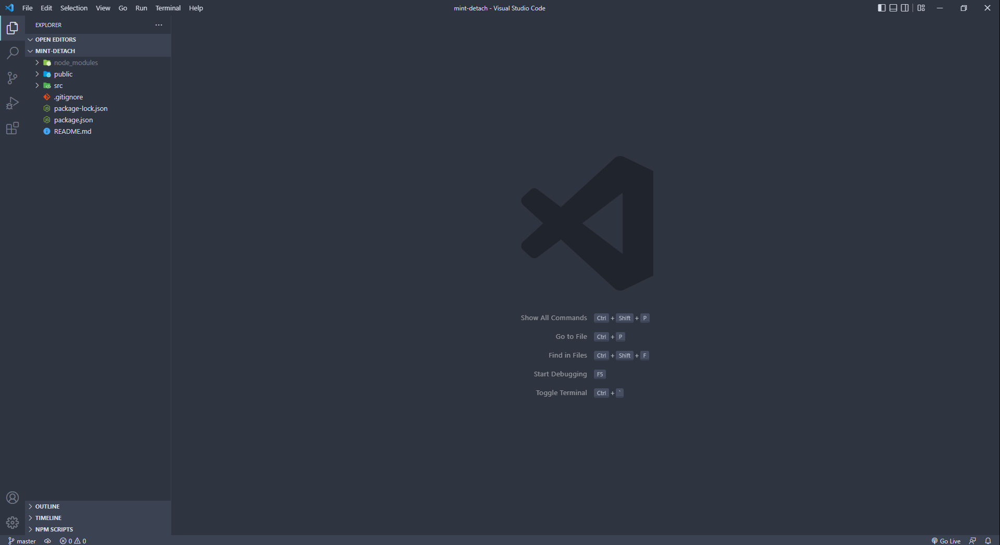
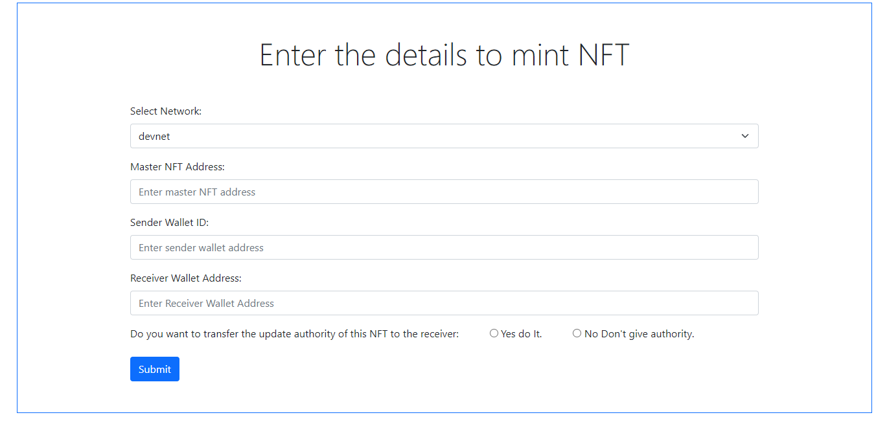
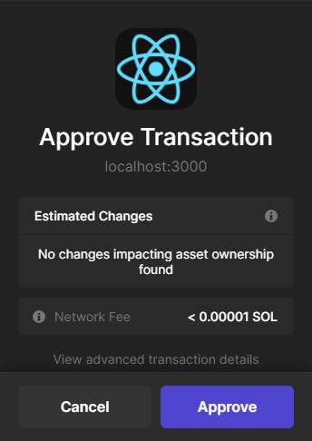
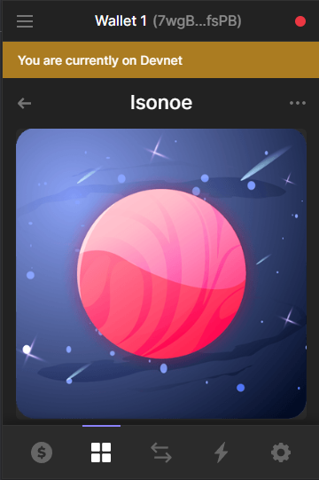

# Mint and add an already created NFT

This is a small sample project in which we will demonstrate how we can mint and add an already created NFT from our wallet to someone else's wallet using [SHYFT](https://shyft.to) APIs. For this project we will refer to the wallet which has the `update_authority` to the NFT as the *sender wallet* and the wallet which in which the NFT will be added after minting will be referred to as the *receiver wallet*. We will accept both the *sender wallet* address and the *receiver wallet* address as inputs, and use the [SHYFT](https://shyft.to) APIs to mint them into *receiver wallet*.

Read the SHYFT API Documentation [here](https://docs.shyft.to/).

## Pre-requisites

To get started, we will need a few things. 

### Authentication: Get your Shyft API key

`x-api-key` is an authentication parameter, which gives you access to SHYFT APIs. You can get your own API Key from the [SHYFT website](https://shyft.to/). Just signup with your email id [here](https://shyft.to/get-api-key) and you can get it for free.

### Phantom Wallet browser extension

We will need the Phantom wallet browser extension, you can download it from the link below.

* [Chrome/Brave](https://chrome.google.com/webstore/detail/phantom/bfnaelmomeimhlpmgjnjophhpkkoljpa).
* [Firefox](https://addons.mozilla.org/en-US/firefox/addon/phantom-app/).

Once done, set up you Phantom wallet account. On screen tips are available which will guide you to set up and get started. You can also find a detailed guide related to this [here](https://news.coincu.com/2433-the-easiest-guide-to-using-phantom-wallet-on-solana/).

We will use React to develop this project but you can choose any language of your choice. As we are using react we will need Node.js installed on our computer. You can download node.js from [here](https://nodejs.org/en/download/).

## Initial Setup
Let's start building, we will use [React - Javascript Library](https://reactjs.org) to build this application, but you can use any scripting language of your choice. Let's start with creating a new react application. Fire up the terminal in the directory in which you want to create the project and execute the following command

```bash
npx create-react-app mint-detach
```
If this command executes successfully, a React frontend build pipeline should be ready inside the directory with the project name(project folder) you have chosen. Here, we have chosen to call our app `mint-detach` but you can name it anything you want. Once done, open the project folder with a code editor of your choice.

** Code Editor **

We have used [`VScode`](https://code.visualstudio.com/) as our code editor for this project but you can use any editor of your choice such as Sublime text, Notepad++, Atom, or any editor of your choice. Once decided, let's open up the project in our code editor. It should look something like this. 



## Form for accepting data

Let's create a very preliminary form for accepting data that we need for minting the NFT. We would need the *sender wallet* address, *receiver wallet* address, *network* in which the NFT exists (be it devnet,testnet or mainnet) and the *master_nft_address* (the address of the NFT which is being minted). So let create a form with the respective fields in it. 



Note that the last field in the form refers to whether or not the *sender_wallet* (the one who currently has the `update_authority` of the NFT being transferred) wants to transfer the `update_authority` of the NFT being transferred to the *receiver_wallet*, 

## The API Call

**Before the API call**

`x-api-key` is an authentication parameter, which gives you access to SHYFT APIs. You can get your own API Key from the SHYFT website. Just signup with your email id [here](https://shyft.to/get-api-key) and you can get it for free.

**Our API endpoint:**

```bash
https://api.shyft.to/sol/v1/nft/mint_detach
```
Unlike other [SHYFT APIs](https://shyft.to/), these APIs (ending with _detach) are a special kind of APIs, which do not perform the action directly, instead it returns a transaction that requires an approval from the user. Once approved, then the intended action gets updated on the blockchain.

We will use the `axios` package to make the API call, but you can use any other packages, or javascript's very own `fetch API`. You can learn more about the `axios` package [here](https://www.npmjs.com/package/axios).

```javascript
axios({
        // Endpoint to get NFTs
        url: 'https://api.shyft.to/sol/v1/nft/mint_detach',
        method: "POST",
        headers: {
          "Content-Type": "application/json",
          "x-api-key": "YOUR_X_API_KEY",
        },
        data: {
          network: network,
          wallet: sender,
          master_nft_address: nftAddress,
          receiver: receiver,
          transfer_authority: auth
        }
      })
```

If successful, we should get a response with the encoded transaction in it. The response looks somewhat like this.

```json
{
  "success": true,
  "message": "NFT Edition mint request generated successfully",
  "result": {
    "encoded_transaction": "AgAAAAAAAAAAAAAAAAAAAAAAAAAAAAAAAAAAAAAAAAAAAAAAAAAAAAAAAAAAAAAAAAAAAAAAAAAAAAAAAAAAAADd/kZ7nuc7bHY1UZVoVPsZ2Slp+9Sz9dwdHYG7/EP0XTgUn5L1oPWrbCiWyhASqoz4vROwbl2Neo1exHuYvnYIAgAID0mioYxx/rk7c0Sls7U3Uq1cPiWEWioadmJJkpfEpJj1IRPDYHVKLFdzmKAhEV5ABsw3PbAIcv3yNkm3z5V2dA0oNsKtkdrxCZh81eIaZc6sHtpoVRDXqCwk2sxG3tUhDS4Opo80GCvyIr4gr+MfwhU03cnO9eEM/I2BvSTn8atGSgv4jEnlxkrsXIO3WpLa65+YPE+hVbcdZfoTSlkuSZace5SwBw7BnI9z9u9hPXYCyNkAAWPPPEqUQJe24xjrsbmyqqUL4gQg6etSyylLP4PMcsG5bcYK4xg9sKxkzNEVAAAAAAAAAAAAAAAAAAAAAAAAAAAAAAAAAAAAAAAAAAAYyp9RxUce7b6XJTmDH3BTasbGTY2hJe2h0xJ16/4PFYyXJY9OJInxuz0QKRSODYMLWhOZ2v8QhASOe9jb6fhZzgOeiS4FIAsM7m2Xp1OR42r2qbdt9WblPm7k6dy0XkQLcGWx49F8RTidUn9rBMPNWLhscxqg/bVJttG8A/gpRgan1RcZLFxRIYzJTD1K8X9Y2u4Im6H9ROPb2YoAAAAABt324ddloZPZy+FGzut5rBy0he1fWzeROoz1hX7/AKkOmNc6v7OEyaYVVIa6Sv4A/AgVM+wz147I5bRZEbS74yKOCI5qZRvBPiwWe60BzPA23jIRrCRiPj2oAj/VJbo9BQcCAAE0AAAAAGBNFgAAAAAAUgAAAAAAAAAG3fbh12Whk9nL4UbO63msHLSF7V9bN5E6jPWFfv8AqQ0CAQxDAABJoqGMcf65O3NEpbO1N1KtXD4lhFoqGnZiSZKXxKSY9QFJoqGMcf65O3NEpbO1N1KtXD4lhFoqGnZiSZKXxKSY9QkHAAMIAQcNDAANAwEDAAkHAQAAAAAAAAALDgYFAgEEAAAADggKDQcMCQsCAAAAAAAAAA==",
    "mint": "D3DWxLFj3LHXcTHFcN7DDXyxFNEJuXsKDukmrfos5H9R"
  }
}
```
As discussed before, it returns an encoded transaction in `result.encoded_transaction`. This `encoded_transaction` will require an authentication from the user before it can successfully perform the operation. To perform this transaction authentication, we will use ***SHYFT's JS SDK***. Once we receive the encoded transaction, we will pass it on to the JS SDK which will allow the users to approve and authenticate using a popup on their wallet. You can learn more about our JS SDK in our upcoming releases or blogs.

```javascript
axios({
        // Endpoint to get NFTs
        url: 'https://api.shyft.to/sol/v1/nft/mint_detach',
        method: "POST",
        headers: {
          "Content-Type": "application/json",
          "x-api-key": "YOUR_X_API_KEY",
        },
        data: {
          network: network,
          wallet: sender,
          master_nft_address: nftAddress,
          receiver: receiver,
          transfer_authority: auth
        }
      })
        // Handle the response from backend here
        .then(async (res) => {
          console.log(res.data);
          if(res.data.success === true)
          {
            const transaction = res.data.result.encoded_transaction;
            console.log(ret_result);
            //send this transaction to the SHYFT JS SDK which will authenticate the transaction after approval from the sender
          }
          else
          {
            console.log('Some Error Occured');
          }
          
        })
        // Catch errors if any
        .catch((err) => {
          console.warn(err);
          setMssg("Failed! Some error occured");
          
        });
```



### The JS SDK

The [SHYFT](https://shyft.to/) JS SDK consists of two functions, and is used for approving and authenticating encoded transactions generated by the [SHYFT APIs](https://shyft.to/) (_detach APIs). The two functions are: 
- ```confirmTransactionFromFrontend()```
- ```confirmTransactionFromBackend()```

These two functions are used for the same purpose, but have different use case scenarios. For this project we have used the function `confirmTransactionFromFrontend()`
 

1. **Confirming transaction from the frontend**

```javascript
function confirmTransactionFromFrontend(connection, encodedTransaction, wallet)
```

This is the function which we have used in this project for signing the encoded transactions. This asynchronous function takes the following parameters: 
- `connection` : This parameter takes in the `connection` object which contains the `JSON RPC connection` to a RPC API URL for the specified cluster. 
```javascript
const rpcUrl = clusterApiUrl(network); //network here maybe devnet, testnet or mainnet-beta
const connection = new Connection(rpcUrl,"confirmed");
```

- `encodedTransaction` : This parameter accepts the `encoded_transaction` which we received in the response of the API call. 
```json
{
  "success": true,
  "message": "NFT Edition mint request generated successfully",
  "result": {
    "encoded_transaction": "THE_ENCODED_TRANSACTION_RECEIVED",
    "mint": "MINT_ADDRESS"
  }
}
```
- `wallet` : This parameter accepts the wallet object which is being used for performing this transaction, in this case the *sender_wallet*. We have used the [Phantom Wallet Adapter](https://www.npmjs.com/package/@solana/wallet-adapter-phantom) to connect to the sender wallet for this sample project.

Once successfully executed, this should display a popup to the user so they can approve (or reject) the transaction.

2. **Confirming transaction from the backend using private keys**

```javascript
function confirmTransactionFromBackend(network, encodedTransaction, privateKey)
```
This asynchronous function has a similar functionality as the previous one, but is used in a different use case scenario, where the `private_key` of the authorizing wallet (in this case the *sender_wallet*) is available. This function has the following parameters: 
- `network`: Takes in the network in which the token exists. It can be any of the following values: 'devnet', 'testnet' or 'mainnet-beta'

- `encodedTransaction` : This parameter accepts the `encoded_transaction` which we receive in the the response of any SHYFT _detach API call. 
```json
{
  "success": true,
  "message": "NFT Edition mint request generated successfully",
  "result": {
    "encoded_transaction": "THE_ENCODED_TRANSACTION_RECEIVED",
    "mint": "MINT_ADDRESS"
  }
}
```
`privateKey` : This parameter accepts the `private_key` of the wallet which has the authority to perform the action which is being performed in the respective API call. In simpler terms, Let's suppose we are trying to `mint` an already created NFT whose `update_authority` is with 'WALLET #1'. So, for this function to work we need to pass the private key of 'WALLET #1'.

**Packages required for the JS SDK to work**

Some of the packages which are required for the JS SDK to work and sign transsaction locally. 
- @solana/web3.js
- @metaplex/js
- @solana/wallet-adapter-phantom (used only in signing transactions from the frontend)

To install these packages, open the terminal in the project folder and execute the following command: 

```bash
npm i <package_name>
```

**Note: every time we install a package, we have to stop and re-run the server using the `npm run start` command**


Once approved, the NFT will be minted and added to the *receiver_wallet*. You can use our `read_all` API to check the NFT that you have just added added to the *receiver_wallet*. Want to know how you can do that? Click here to know more.



## Bonus tip: How to sign transactions locally with the secret key

Let's consider this same example where we are minting and adding an NFT, whose `update_authority` is with WALLET#1 (will be referred here as the `sender_wallet`), to WALLET#2 (will be referred here as the `receiver_wallet`), but instead of signing and approving the transaction using the popup in the frontend, we will use the Private Key of the `sender_wallet` to sign and approve the transaction locally. 

Let's go back a few steps to the point where we were making the API call and getting the `encoded_transaction` in the response. 

```javascript
axios({
        // Endpoint to get NFTs
        url: 'https://api.shyft.to/sol/v1/nft/mint_detach',
        method: "POST",
        headers: {
          "Content-Type": "application/json",
          "x-api-key": "YOUR_X_API_KEY",
        },
        data: {
          network: network,
          wallet: sender,
          master_nft_address: nftAddress,
          receiver: receiver,
          transfer_authority: auth
        }
      })
        // Handle the response from backend here
        .then(async (res) => {
          console.log(res.data);
          //We get the encoded_transaction here 
          //which we will sign from the backend using the JS SDK
          if(res.data.success === true)
          {
            const transaction = res.data.result.encoded_transaction;
            console.log(ret_result);
            
          }
          else
          {
            console.log('Some Error Occured');
          }
          
        })
        // Catch errors if any
        .catch((err) => {
          console.warn(err);
          setMssg("Failed! Some error occured");
          
        });
```

Once we have the `encoded_transaction`, we will use the ```confirmTransactionFromBackend()``` function from the JS SDK to sign and authenticate the transaction. This function accepts the Private Key of the *sender_wallet* as one of the parameters. We can accept this Private Key using a form field from the sender in this project, or we can also load it from an `.env` file.

Once we have the private key, we are ready to make the function call. As explained before, the asynchronous ```confirmTransactionFromBackend()``` function accepts 3 parameters: `network`, `encoded_transaction` and `privateKey`, the function call would look something like 

```javascript
await confirmTransactionFromBackend('devnet','THE_ENCODED_TRANSACTION','THE_PRIVATE_KEY_OF_THE_SENDER_WALLET');
```
Once successfully executed, this should sign and approve the transaction, and the intended operation, which in this case is the NFT minting operation,will be complete.


That's pretty much everything about this sample project tutorial. If you enjoyed it, and want to try out our code, you can [clone the code](https://) from our GitHub repository. 


